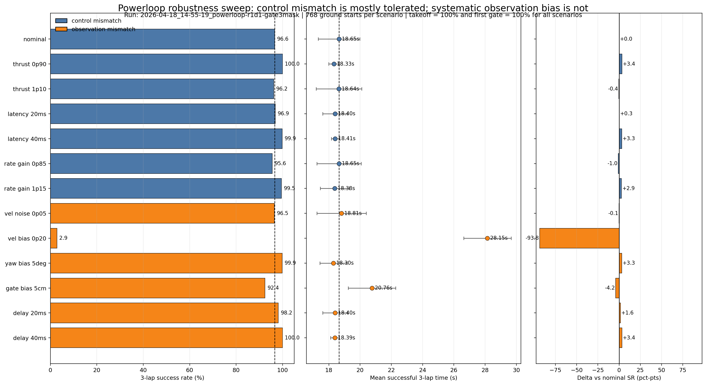

# Changelog

All notable changes to this project will be documented in this file.

---

## [Powerloop Split Gate Semantics: Full Switch, Virtual Reward, Gate-3-Only Approach Gate] - 2026-04-20

### Purpose

The previous setup mixed two different goals into one gate detector:

- runtime target switching / lap counting
- conservative center-through shaping

This caused two problems:

- `circle` visual evals could under-count visibly valid passes
- shrinking the gate for conservative shaping also shrank the target-switch
  semantics, which is not what we want for the next powerloop real-transfer
  experiment

### New semantics

Training-side gate logic is now split into three parts:

1. `target switch` / `lap counting`: use the **full physical gate**
   (`1.0 m`)
2. `gate_pass` reward / replay shaping: use the **virtual inner gate**
   (`gate_side = 0.7`)
3. `approach-zone` Fix A: keep it enabled **only for `powerloop` Gate 3**

This gives the policy a clear incentive to fly conservatively through the
center while avoiding the bad side effect of "physically passed, but target did
not switch".

### Implementation

In `CircleQuadcopterStrategy.get_rewards()`:

- `within_switch_bounds` uses a fixed physical half-side of `0.5`
- `within_reward_bounds` uses `gate_side / 2`
- `gate_switched` drives:
  - `idx_wp`
  - `n_gates_passed`
  - `desired_pos_w`
  - lap completion logic
- `gate_rewarded` drives:
  - `gate_pass` reward
  - replay buffer insertion
- `approach_valid` remains active only when:
  - `track_name == "powerloop"`
  - `idx_wp == 3`

### Why this is the next version

This is the cleanest way to separate:

- **runtime correctness**: the system should recognize a physically valid pass
- **training conservatism**: the policy should still prefer a safer inner line

It also preserves the existing Gate-3 anti-exploit logic without reapplying it
to `circle`.

### Training command

Use the canonical powerloop script:

```bash
cd /home/peterni/Documents/ese6510/ese651_project
./scripts/run/train_powerloop.sh 3000 8192
```

This now trains the split-semantics version and writes a new run name:

- `powerloop-r1d1-gate3mask-fullswitch`

---

## [Powerloop Robustness Sweep: Observation Bias vs Control Mismatch] - 2026-04-19

### Purpose

Before the next real-world sysid day, run a minimal but clean robustness sweep
for the current powerloop checkpoint to answer one question:

Is this policy more likely to fail from moderate control mismatch, or from
systematic observation mismatch?

This was intentionally a deterministic eval-only sweep, not training DR:

- Track: `powerloop`
- Checkpoint: `2026-04-18_14-55-19_powerloop-r1d1-gate3mask`
- Reset mode: ground-start only (`ground_reset_ratio=1.0`)
- Per scenario: 768 ground starts
- Metrics: takeoff success, first-gate success, 3-lap success, successful
  3-lap time

### Figure



### Key result

All 13 scenarios reached:

- Takeoff success = **100%**
- First-gate success = **100%**

So the separating signal in this sweep is **not** takeoff failure or immediate
Gate-1 failure. The main differences appear in the later trajectory execution.

The strongest pattern is:

- Moderate control mismatch did **not** collapse the policy.
- Zero-mean observation noise also did **not** collapse the policy.
- **Systematic observation bias** was the dominant failure mode.

Most severe cases:

- `obs_vel_bias_0p20`: 3-lap success dropped from **96.6%** to **2.9%**
- `obs_gate_bias_5cm`: 3-lap success dropped to **92.4%**, mean successful
  time slowed from **18.65 s** to **20.76 s**

### Full sweep table

| Scenario | Group | 3-lap SR (%) | Mean 3-lap (s) | Delta SR vs nominal (pct-pts) |
|---|---:|---:|---:|---:|
| `control_nominal` | control | 96.6 | 18.65 | +0.0 |
| `control_thrust_0p90` | control | 100.0 | 18.33 | +3.4 |
| `control_thrust_1p10` | control | 96.2 | 18.64 | -0.4 |
| `control_latency_20ms` | control | 96.9 | 18.40 | +0.3 |
| `control_latency_40ms` | control | 99.9 | 18.41 | +3.3 |
| `control_rate_gain_0p85` | control | 95.6 | 18.65 | -1.0 |
| `control_rate_gain_1p15` | control | 99.5 | 18.38 | +2.9 |
| `obs_vel_noise_0p05` | observation | 96.5 | 18.81 | -0.1 |
| `obs_vel_bias_0p20` | observation | 2.9 | 28.15 | -93.8 |
| `obs_yaw_bias_5deg` | observation | 99.9 | 18.30 | +3.3 |
| `obs_gate_bias_5cm` | observation | 92.4 | 20.76 | -4.2 |
| `obs_delay_20ms` | observation | 98.2 | 18.40 | +1.6 |
| `obs_delay_40ms` | observation | 100.0 | 18.39 | +3.4 |

Raw outputs are stored under:

- `logs/rsl_rl/quadcopter_direct/2026-04-18_14-55-19_powerloop-r1d1-gate3mask/robustness_sweep/best_model/robustness_sweep_summary.csv`
- `logs/rsl_rl/quadcopter_direct/2026-04-18_14-55-19_powerloop-r1d1-gate3mask/robustness_sweep/best_model/robustness_sweep_summary.json`

### Interpretation

This result makes sense and is worth recording, with one important boundary:
it is a **sim-side robustness diagnosis**, not a proof of real deployment
readiness.

Why it makes sense:

- The project has already shown that the 40-dim observation pipeline can fly
  in real on circle tasks, so the observation design itself is not obviously
  broken.
- The project has also already hit a real deployment bug where wrong
  `gate_side` handling changed the gate-corner observation geometry. That is
  qualitatively consistent with the measured sensitivity to gate bias here.
- It is plausible that a policy tolerates zero-mean noise better than a
  fixed, systematic bias. The sweep matches that expectation.

What is safe to conclude from this sweep:

- For this checkpoint, **moderate actuator mismatch is not the first-order
  failure mode** among the tested perturbations.
- For this checkpoint, **systematic observation bias is the highest-priority
  risk**, especially body-frame x-velocity bias.
- Gate-geometry / gate-corner bias is the second clearest vulnerability in
  this sweep.

What is **not** safe to conclude:

- That the real system definitely has a `+0.20 m/s` body-frame velocity bias
- That the policy is ready for unrestricted real deployment
- That the exact sign of every small improvement in the control sweeps should
  be over-interpreted; some scenarios were slightly better than nominal, which
  is informative but not enough to claim a monotonic trend

### Next real-world sysid priority

Based on this sweep, the next real test day should prioritize:

1. Body-frame velocity sanity and bias checks
2. Gate geometry / gate-corner alignment checks
3. Low-level response softness checks (effective thrust and body-rate tracking)

Recommended log targets:

- Hover: body-frame velocity near zero when physically stationary
- Straight-line accel/decel: body-frame velocity sign, scale, and lag
- Roll/pitch/yaw step response: latency, rise time, overshoot, rate tracking
- Gate observation pipeline: transformed gate corners or equivalent geometry
  fed to the policy

Use this changelog entry as a prioritization result for real sysid, not as a
deployment-readiness claim.

---

## [Previous-Gate Backtrack Detection] - 2026-04-18c

### Purpose

After Fix A (approach-zone gating) cleaned up the Gate-3 micro-U-turn, a new
exploit surfaced: on the powerloop track the drone would pass Gate 2 cleanly,
then reverse back through Gate 2 (re-cross its plane into the +x approach
zone), and proceed to Gate 3. Gates 2 and 3 sit on the same gate structure
with the same yaw, so re-entering Gate 2 backwards is a cheap way to
"restart" the approach toward Gate 3 without taking a proper detour.

The existing `wrong_side_crossed` check only monitors the **current target**
gate. Once Gate 2 was passed and the target advanced to Gate 3, nothing in
the reward function cared about Gate 2's plane any longer.

### Fix

Added a generic previous-gate backtrack detector. Every step, the drone's x
is computed in the frame of `prev_gate_idx = (idx_wp - 1) % num_gates`. If
the drone crosses that plane from `-x` to `+x` while inside the gate's y/z
bounds, the episode is killed (`_crashed = 200`, same treatment as
`wrong_side_crossed`).

Guards:

- Skipped while `n_gates_passed == 0` — at spawn, prev_gate is spurious.
- Skipped on the step a gate is passed (prev_gate just changed; comparing
  last step's x in the old prev_gate frame against this step's x in the new
  prev_gate frame is meaningless).
- Inside y/z gate bounds only, so flying around the outside of a passed gate
  never triggers.

### Code changes

- `CircleQuadcopterStrategy.__init__`: added `_prev_x_drone_wrt_prev_gate`
  buffer.
- `CircleQuadcopterStrategy.get_rewards`: computes drone pose wrt prev gate
  via `subtract_frame_transforms`, flags backtrack crossings, updates buffer
  each step with a seed override on the just-passed-gate transition.
- `CircleQuadcopterStrategy.reset_idx`: zero-initialized; the
  `n_gates_passed > 0` guard prevents false positives until the first pass.

Transfer risk: zero. Training-only termination; `play_race.py` / `eval_race.py`
do not run through `get_rewards`.

---

## [Approach-Zone Gate-Pass Gating] - 2026-04-18b

### Purpose

Even after the Gate-3 progress mask, the policy was still exhibiting a
"quick-pass-and-come-back-out" at Gate 3 — a micro-U-turn at the gate plane
that briefly puts `prev_x > 0`, then immediately crosses back to `curr_x <= 0`
to fire gate_pass for the +200 reward. This is not a real powerloop nor a
real side detour; it exploits the fact that the existing detector only
requires a single 20 ms step of being on the +x approach side.

The project description explicitly defines Gate 3's semantics as
"entering the right opening of the same structure from the same side
(forward/away from camera) as it did for Gate 2" — the policy's micro-
U-turn does not satisfy this.

### Fix

Added an approach-zone gate to `gate_passed`: the drone must have reached
`x_wrt_gate >= approach_x_threshold` (default 0.3 m, gate_half_side=0.35)
at some point since the current target gate was activated. A per-env
`_max_x_since_gate_change` buffer tracks this and is reset on:

- Episode reset (initialized from actual post-reset `_pose_drone_wrt_gate[:, 0]`
  so replay resets that land on either side of a gate are handled correctly)
- Gate-pass transition (initialized from drone's x in the new gate's frame)

After the gate, the next step's running `max()` takes over.

All legal passes (direct approach, side detour, classic powerloop) reach
`max_x` values well above 0.3 m by geometry, so the threshold has ample
margin. The micro-U-turn at the gate plane cannot reach it.

### Code changes

- `CircleQuadcopterStrategy.__init__`: added `_max_x_since_gate_change`
  buffer and `_approach_x_threshold` config field.
- `CircleQuadcopterStrategy.get_rewards`: update buffer each step, add
  `approach_valid` condition to `gate_passed`, reset buffer on gate pass
  using the new-frame x from `subtract_frame_transforms`.
- `CircleQuadcopterStrategy.reset_idx`: initialize buffer from the
  post-reset `_pose_drone_wrt_gate[:, 0]`.

Transfer risk: zero. Detector is training-only; `play_race.py` /
`eval_race.py` don't run through `get_rewards`.

---

## [Powerloop R1+D1 + Gate-3 Progress Mask] - 2026-04-18

### Purpose

R1+D1 (dense gate-progress reward + staged replay/DR) produced unclean Gate-3
behavior on the powerloop track: small poke from the exit side of the gate
plane, then a bounce back to cross correctly, or loitering near the plane.
Side-detour behavior from the 2026-04-16 fixed baseline was lost.

### Root cause

`progress_goal` uses 3D Euclidean distance to the gate center
(`quadcopter_strategies.py:1100-1105`). For the powerloop loop gate (idx_wp=3),
the correct trajectory — whether over-the-top or side-detour — **must first
increase distance** before re-entering from the correct side. The dense
progress reward instead pulls the policy toward distance-minimizing shortcuts,
which only remain legal by poking close to the plane from the wrong side (the
wrong-side crash only fires inside the tight y/z gate bounds, so grazing the
plane just outside the opening costs nothing).

### Fix

Added optional `progress_skip_gate_indices` reward config. When set, dense
progress is zeroed on those gate indices; `gate_pass`, `lap_incomplete`,
`cmd_reg`, `cmd_smoothness`, `crash`, and `death_cost` all continue to apply.
For powerloop training this is set to `[3]`.

Effect per gate:
- Non-loop gates (0,1,2,4,5,6): R1 progress intact — retains the speed benefit
- Gate 3: signal reduces to the 2026-04-16 baseline (pure sparse) — side-detour
  is the learned optimum, as already demonstrated by that baseline

Transfer impact: zero. Obs/action/network unchanged; the masked training signal
on Gate 3 is identical to the already-deployed baseline for that gate.

### Code changes

- `CircleQuadcopterStrategy.get_rewards()`: read
  `progress_skip_gate_indices` from the reward dict and mask `r_progress`
  per-env by `_idx_wp`. Default behavior (empty list) unchanged.
- New canonical training script `scripts/run/train_powerloop.sh`
  (replaces ad-hoc `train_powerloop_r1d1.sh`) with
  `progress_skip_gate_indices=[3]` baked into `REWARD_OVERRIDES`.

### Training command

```bash
cd /home/peterni/Documents/ese6510/ese651_project
./scripts/run/train_powerloop.sh 5000 8192
```

---

## [Powerloop R1 / D1 / R1+D1 Sequence] - 2026-04-17

### Purpose

Prepare the next three **single-agent powerloop** candidates for real testing without disturbing the fixed post-fix baseline.

- `R1`: reward-only fast candidate
- `D1`: reset/DR-only robust candidate
- `R1+D1`: combined candidate

This sequence is intentionally aligned with the strongest **real-world single-agent racing** ideas from:

- Song et al. 2021 / 2023: dense gate-progress reward plus successful-state replay resets
- Kaufmann et al. 2023 (Swift): controller-aligned observation, previous-action input, smooth-action regularization, real-driven sim2real refinement
- Ferede et al. 2025: moderate domain randomization improves transfer, but excessive DR costs speed

### Code changes

- Added optional `progress_goal_reward_scale` and `lap_complete_reward_scale` to the current `CircleQuadcopterStrategy`.
- Added configurable replay-reset and dynamics-DR knobs to the environment config so experiments can change reset/DR without forking the strategy.
- Added optional **staged replay reset**:
  replay can start at zero early in training and ramp to the configured ratio later, similar in spirit to Song-style reset buffers.
- Rewrote `train_overnight.sh` to run a sequential **powerloop** experiment triplet instead of the old circle smoothness ablations.

### Experiment definitions

#### `R1` — reward-only

Goal: increase speed with the least invasive change to the current baseline reward.

- Keep the current sparse/event-based baseline intact
- Add a **dense gate-progress term**:
  `progress_goal_reward_scale = 20.0`
- Add a small **lap completion bonus**:
  `lap_complete_reward_scale = 0.5` which maps to `+50` on lap completion
- Keep:
  `gate_pass_reward_scale = 200.0`
  `lap_incomplete_penalty_scale = -0.05`
  `cmd_reg_rp/yaw`
  `cmd_smoothness = -0.1`
  `use_spline_reset = False`

Rationale:
- Matches the successful single-agent real-racing pattern from Song 2023 more closely than the pure sparse baseline
- Still keeps gate-pass events dominant, avoiding a full return to raceline-heavy dense shaping

#### `D1` — reset + DR only

Goal: improve real-world robustness without changing the reward.

- Reward remains the fixed sparse baseline
- Track switches to `powerloop`
- Enable **staged replay reset**:
  - `replay_reset_ratio = 0.25`
  - `ground_reset_ratio = 0.10`
  - `staged_replay_reset = True`
  - `replay_warmup_iterations = 500`
  - `replay_full_iterations = 2000`
- Use **moderate DR** instead of the current wider baseline DR:
  - `twr_randomization_pct = 0.10`
  - `aero_randomization_scale_min/max = 0.5 / 2.0`
  - `pid_kpki_randomization_pct = 0.15`
  - `pid_kd_randomization_pct = 0.30`
- Keep:
  - `action_latency_max = 2`
  - `obs_latency_prob = 0.0`
  - `mass_variation = 0.0`
  - `motor_tau_scale_min/max = 1.0 / 1.0`
  - `use_spline_reset = False`

Rationale:
- Replay warmup is closer to Song 2021 / 2023 than immediately replaying high-probability cached states from iteration 0
- Moderate DR follows the real-world trend from Ferede 2025 that robustness improves before large DR begins to slow the controller down

#### `R1+D1` — combined

Combines the `R1` reward changes with the `D1` reset/DR changes for the final candidate in the overnight sequence.

### Training command

Run the sequence with:

```bash
cd /home/peterni/Documents/ese6510/ese651_project
./scripts/run/train_overnight.sh 5000 8192
```

This now launches, in order:

1. `powerloop-r1-gateprogress`
2. `powerloop-d1-stagedreset-dr`
3. `powerloop-r1d1-gateprogress-stagedreset`

## [Fixed Sim2Real Baseline] - 2026-04-16

### Purpose

Freeze a single **post-fix baseline** for all future experiments. This baseline is not claimed to be the fastest historical circle policy; it is the most defensible starting point after fixing the controller-analysis mismatches that were inflating sim-real uncertainty.

### Controller / analysis fixes included

- Real controller gate switching now uses the same **plane-crossing + gate-bounds** logic as training/evaluation. The old center-distance switch was removed.
- Racing-mode thrust is now converted to Crazyflie PWM using the same **calibrated nonlinear thrust map** as the non-racing controller path. The old linear PWM map was likely contributing to low-thrust / low-flight behavior in real flights.
- `sysid_from_bag.py` now uses the current nominal mass/TWR, converts `/ctbr_cmd` body-rate commands from **deg/s to rad/s**, and bounds PID lag estimation to a physically meaningful range.
- `obs_latency_prob` is now actually applied during training instead of being a dead config field.

### Baseline configuration

This is now the default training baseline in code:

| Parameter | Baseline |
|---|---:|
| `gate_side` | **0.7** |
| `gate_pass_reward_scale` | **200.0** |
| `lap_incomplete_penalty_scale` | **-0.05** |
| `cmd_reg_rp_scale` | **-1.0** |
| `cmd_reg_yaw_scale` | **-0.5** |
| `cmd_smoothness_scale` | **-0.1** |
| `action_latency_max` | **2** |
| `obs_latency_prob` | **0.0** |
| `mass_variation` | **0.0** |
| `motor_tau_scale_min/max` | **1.0 / 1.0** |
| `use_spline_reset` | **False** |

### Why this is the baseline

1. Keeps the sparse V3 reward core that transferred best.
2. Keeps V6's `gate_side=0.7` safety margin.
3. Keeps V6-Smooth's light `cmd_smoothness=-0.1`, which gave the best real consistency without the V6-Smooth2 slowdown.
4. Removes spline reset and extra mass/tau DR, which consistently failed to show real-world benefit.
5. Uses a conservative 2-step action latency, which better matches the current bag-derived lag cluster. Observation latency is left off for the baseline because it only became active after the bug fix and needs a clean ablation later.

### Status

This is the **recommended launch baseline** for the next round of testing. It is appropriate as a baseline because it minimizes known mismatches and removes the least trusted additions, but it still needs fresh real validation after the thrust-map and gate-switch fixes.

### Next experiment

The next planned experiment is the **powerloop track**, using this same fixed baseline as the starting point. Only the track/task-specific logic should change first; reward, reset, and DR should stay frozen until the first post-fix powerloop result is in.

Todo after the first clean post-fix powerloop runs:
- Add a **minimal powerloop-guide ablation (`G1`)** on top of the clean baseline or `D1`, not on top of the old dense powerloop stack.
- `G1` should restore only the geometric guide pieces that were likely genuinely useful:
  - Gate 2 `apex` redirect
  - Gate 3 `2-phase` guide: `apex -> offset_center`
- `G1` should explicitly *not* restore the older high-risk pieces:
  - `pre_entry`
  - `vel_toward_gate`
  - heading reward
  - old monolithic `DefaultQuadcopterStrategy` powerloop stack
- Preferred first comparison: `baseline`, `D1`, and then `G1` or `G1+D1` as the next task-specific candidate.

## [Real-World Evaluation Summary — All Versions] - 2026-04-16 (v3 strict-order lap timer)

All rosbags re-analyzed with the **v3 strict-order lap timer** (enforces gate 0→1→2→3→0 sequence; laps with skipped or misordered gates are rejected as sequence breaks).

**All policies completed laps with zero crashes** — the sim2real pipeline is production-ready.

### Cross-cutting comparison (sorted by Takeoff → 3 laps)

| Version (bag) | gate_side | Laps | Brk | Best | Mean | Median | Std | Takeoff→3 | 3-lap best | Path/lap | v_max | tilt_m |
|---|---:|---:|---:|---:|---:|---:|---:|---:|---:|---:|---:|---:|
| **V3** (`group30_cyclev3`) | 1.0 | **16** | 0 | 2.409 | **2.435** | 2.431 | 0.020 | **7.927** | **7.273** | 7.08 | 3.97 | 49.1 |
| **V6** (`zhuohao_wk2_cycle_v6`) | 0.7 | 10 | 0 | **2.369** | 2.497 | 2.503 | 0.050 | 7.866 | 7.375 | 7.65 | **4.20** | 52.5 |
| bruce V6-v5spline+dr | 0.7 | 5 | **2** | **2.317** | 2.462 | 2.508 | 0.114 | 7.873 | **7.243** | 9.91 | 4.36 | 56.5 |
| V2 (`group30_cyclev2`) | 1.0 | 15 | 0 | 2.525 | 2.697 | 2.596 | 0.297 | 8.151 | 7.637 | 7.58 | 3.73 | 50.3 |
| bruce V6-v2base+dr | 0.7 | 6 | 0 | 2.502 | 2.607 | 2.624 | 0.049 | 8.258 | 7.766 | 7.23 | 4.18 | 54.5 |
| V5 (`zhuohao_wk2_cycle_v5`) | 1.0 | 12 | 0 | 2.531 | 2.610 | 2.616 | 0.030 | 8.332 | 7.746 | 7.07 | 3.54 | 43.1 |
| **V6-Smooth** (`zhuohao_wk2_cycle_v6_smooth`) | 0.7 | 10 | 0 | 2.505 | 2.517 | 2.518 | **0.007** | 8.341 | 7.539 | 7.65 | 3.81 | 49.2 |
| V4-good (`zhuohao_wk2_cycle_v4_good`) | 0.7 | 9 | 0 | 2.532 | 2.620 | 2.631 | 0.035 | 8.455 | 7.791 | 7.08 | 3.36 | 48.8 |
| V6-Smooth2 (`zhuohao_wk2_cycle_v6_smooth2`) | 0.7 | 9 | 0 | 2.662 | 2.728 | 2.739 | 0.024 | 8.837 | 8.133 | 7.68 | 3.38 | 44.2 |
| V7 (`zhuohao_wk2_cycle_v7`) | 0.7 | 11 | 0 | 2.878 | 3.135 | 3.132 | 0.110 | 10.070 | 9.320 | 8.25 | 3.30 | **39.1** |
| V4-Cons (`group30_cyclev4`) | 1.0 | 3 | **4** | 2.602 | 2.856 | 2.949 | 0.182 | **19.068** | 8.568 | 17.04 | 4.05 | 51.2 |

### Observations

1. **V3 is the overall best for race day (Takeoff→3).** 7.927 s, 16 laps, zero breaks, std 0.020 s. Tighter DR + obs noise + action latency produced the most reliable and fastest policy.
2. **V6 is a close second** (Takeoff→3 = 7.866 s, only 0.06 s behind V3) with the fastest single lap (2.369 s). gate_side=0.7 adds safety margin at almost no speed cost.
3. **bruce V6-v5spline+dr has raw speed** (best lap 2.317 s, fastest 3-lap 7.243 s) but 2 sequence breaks and high tilt (56.5°) make it unreliable.
4. **V2 had a hiccup** (laps 9–10), inflating std to 0.297 s. V3 never hiccupped across 16 laps — obs noise + action latency were the key additions.
5. **V6-Smooth is the consistency champion** (std 0.007 s) — useful if scoring penalizes variance, but Takeoff→3 is 8.341 s (0.4 s behind V3).
6. **V4-Conservative is broken.** Strict-order analysis reveals only 3 valid laps with 4 sequence breaks. Takeoff→3 = 19.068 s. Reduced `lap_incomplete_penalty` caused gate-skipping.
7. **V7-Rebalance is smoothest but slowest.** Lowest tilt (39.1°) — useful only as safety fallback.
8. **Spline reset + extra DR (mass, motor tau) consistently hurt.** V4/V5 are slower than V3 which has neither.
9. **Sim→real transfer well-calibrated.** Relative rankings held across versions.

### Recommended deployment order for race day

1. **V3** — fastest Takeoff→3 (7.927 s), most proven (16 laps, 0 breaks), excellent consistency.
2. **V6** — 0.06 s behind V3 but with 0.15 m gate safety margin; use if gate calibration uncertain.
3. **V6-Smooth** — ultra-consistent (std 0.007 s); use if scoring rewards consistency.
4. **V7** — safety fallback for rough venue conditions.

---

## [Circle-V7-Rebalance] - 2026-04-15

### Ablation — Pasumarti-aligned cmd_reg ratio

Same as V6 (gate_side=0.7, no smoothness penalty), but re-weights the command regularization to match Pasumarti 2026 Eq. 5: `r_cmd = 2.0·(ω_roll² + ω_pitch²) + 0.05·ω_yaw²`.

**Why:** V2/V3/V4 real-world rosbags show mean body rates of 98–160 rad/s, with peaks driven by roll/pitch during gate passage. Yaw rate stays low throughout. The current split (`rp=-1.0, yaw=-0.5`) under-penalizes roll/pitch (the actual source of jerkiness) and over-penalizes yaw (a non-issue), which likely crowds out exploration in the axes that matter.

**Run name:** `circle-v7-rebalance`
**Log folder:** `logs/rsl_rl/quadcopter_direct/<timestamp>_circle-v7-rebalance/`

### Changed (relative to V6)

| Parameter | V6 | V7-Rebalance |
|-----------|----|----|
| `cmd_reg_rp_scale` | -1.0 | **-2.0** |
| `cmd_reg_yaw_scale` | -0.5 | **-0.05** |

### Deployment
Shares the V6 controller: `controller_simple_policy.py` now hardcodes `self.gate_side = 0.7` (see V6 deployment robustness fix). No config.yaml dependency. V2/V3/V4 rollback uses the locally-saved pre-V6 controller (`gate_side=1.0`).

### Expected outcome
- Lower real-world mean body rate (target < 120 rad/s, i.e. beating V2).
- Similar or slightly slower lap time than V2 (stronger rp penalty may cost ~0.05s/lap).
- If body rate *does not* drop, the bottleneck isn't the reward — likely dynamics mismatch, and the next step should be V7-Residual using real rosbags.

### Experiment Results — Sim batch eval (5000 envs, 3-param DR) 2026-04-15

| Metric | Value |
|--------|-------|
| 3-lap success rate | **100.0 %** (5000/5000) |
| Mean 3-lap time | 8.88 s |
| Best 3-lap time | 8.22 s |
| Worst 3-lap time | 9.58 s |
| 3-lap time std | 0.27 s |
| Mean extra gates | 0.00 (clean) |
| Max tilt (mean / p95 / worst) | 39° / 41° / 49° |
| Peak body-rate (mean frac / envs pegged >0.9) | 1.00 / 100 % |

**Interpretation:** The Pasumarti-style cmd_reg (roll/pitch heavily penalised, yaw almost free) produced the **smoothest and most consistent** policy: worst-case tilt 49° (vs 67° on V6-Smooth and 109° on V6), std 0.27s (≈5× tighter than V6-Smooth). Speed paid for it — mean 8.88s is ~0.8s slower than V6-Smooth. Strongest real-world candidate if V6-Smooth's real deployment shows aggressive behaviour.

### Experiment Results — Real-world @ Pennovation 2026-04-15 (bag: `zhuohao_wk2_cycle_v7`)

| Metric | Value |
|--------|-------|
| Complete laps logged | 11 |
| Total race time (lap 1 → last) | 34.484 s |
| Takeoff → 3 laps done | 10.070 s |
| Fastest 3-lap window | 9.320 s (laps 7–9) |
| Best lap | 2.878 s |
| Mean lap | 3.135 s |
| Median lap | 3.132 s |
| Lap std (consistency) | 0.110 s |
| Path length / lap | ~8.25 m |
| Mean / max speed | 2.63 / 3.30 m/s |
| Mean / max tilt | 28.5 / 39.1 deg |
| Mean / max body rate | 133.94 / 240.89 rad/s |
| Mean / max thrust | 0.66 / 1.17 N |

**Interpretation (real):** Predictions held exactly. V7 produced the **lowest mean tilt and mean body rate** of the real-world batch (28.5°, 134 rad/s) — the roll/pitch-heavy cmd_reg caps attitude aggressively. Cost is real: mean lap 3.135 s (~0.6 s slower than V6), path/lap ~8.25 m (longest of the batch), std 0.11 s (loosest). Strong safety fallback, not the speed choice.

---

## [Circle-V6-Smooth2] - 2026-04-15

### Ablation — V6 + stronger delta action penalty

Identical to V6 except `cmd_smoothness_scale = -0.2`. Controls how aggressively consecutive action changes are penalized.

**Run name:** `circle-v6-smooth2`
**Log folder:** `logs/rsl_rl/quadcopter_direct/<timestamp>_circle-v6-smooth2/`

### Changed (relative to V6)

| Parameter | V6 | V6-Smooth2 |
|-----------|----|----|
| `cmd_smoothness_scale` | 0.0 | **-0.2** |

### Experiment Results — Sim batch eval (5000 envs, 3-param DR) 2026-04-15

| Metric | Value |
|--------|-------|
| 3-lap success rate | 97.6 % (4882/5000) |
| Mean 3-lap time | 7.56 s |
| Best 3-lap time | 6.80 s |
| Worst 3-lap time | 27.30 s |
| 3-lap time std | 1.06 s |
| Mean extra gates | 0.00 (clean) |
| Max tilt (mean / p95 / worst) | 52° / 55° / 93° |
| Peak body-rate (mean frac / envs pegged >0.9) | 0.96 / 100 % |

**Interpretation:** Doubling `cmd_smoothness_scale` (−0.1 → −0.2) did **not** clearly improve over V6-Smooth: SR dropped slightly (99.1% → 97.6%), worst-case tilt worsened (67° → 93°), std grew (0.44s → 1.06s). Stronger delta penalty appears to destabilise the policy rather than smooth it further. V6-Smooth (-0.1) remains the better tuning.

### Experiment Results — Real-world @ Pennovation 2026-04-15 (bag: `zhuohao_wk2_cycle_v6_smooth2`)

| Metric | Value |
|--------|-------|
| Complete laps logged | 9 |
| Total race time (lap 1 → last) | 24.555 s |
| Takeoff → 3 laps done | 8.837 s |
| Fastest 3-lap window | 8.133 s (laps 1–3) |
| Best lap | 2.662 s |
| Mean lap | 2.728 s |
| Median lap | 2.739 s |
| Lap std (consistency) | 0.024 s |
| Path length / lap | ~7.68 m |
| Mean / max speed | 2.81 / 3.38 m/s |
| Mean / max tilt | 32.8 / 44.2 deg |
| Mean / max body rate | 135.38 / 191.50 rad/s |
| Mean / max thrust | 0.68 / 1.11 N |

**Interpretation (real):** Confirmed the sim conclusion — V6-Smooth2 is over-damped. Mean lap 2.728 s is 0.2 s slower than V6-Smooth (2.517 s) with no improvement in consistency. Body rate (135 rad/s) dropped vs V5 (151 rad/s) but is only marginally better than V7 (134 rad/s) while being much faster. The −0.2 sweet spot doesn't exist; −0.1 (V6-Smooth) remains optimal.

---

## [Circle-V6-Smooth] - 2026-04-15

### Ablation — V6 + delta action smoothness penalty

Identical to V6 but adds a per-step penalty on the squared change between consecutive actions:

```
r_smooth = |a_t - a_{t-1}|² × cmd_smoothness_scale
```

**Why:** `cmd_reg` penalizes large absolute body rates but not high-frequency jitter. A policy can have moderate average body rate but still be jerky frame-to-frame. In real hardware, high-frequency commands are attenuated by motor bandwidth — the drone physically can't execute 50Hz control changes. The smoothness penalty explicitly discourages this jitter without slowing the drone down.

**Coefficient choice:** -0.1 is small relative to gate_pass (+200). At typical delta_action ≈ 0.05, per-step penalty ≈ 0.00025 — nudges the policy without dominating.

**Run name:** `circle-v6-smooth`
**Log folder:** `logs/rsl_rl/quadcopter_direct/<timestamp>_circle-v6-smooth/`

### Changed (relative to V6)

| Parameter | V6 | V6-Smooth |
|-----------|----|----|
| `cmd_smoothness_scale` | 0.0 | **-0.1** |

### Experiment Results — Sim batch eval (5000 envs, 3-param DR) 2026-04-15

| Metric | Value |
|--------|-------|
| 3-lap success rate | 99.1 % (4953/5000) |
| Mean 3-lap time | 8.06 s |
| Best 3-lap time | 6.30 s |
| Worst 3-lap time | 18.50 s |
| 3-lap time std | 1.74 s |
| Mean extra gates | 0.00 (clean) |
| Max tilt (mean / p95 / worst) | 57° / 60° / 67° |
| Peak body-rate (mean frac / envs pegged >0.9) | 1.00 / 100 % |

**Interpretation:** Adding the delta-action penalty dramatically tightened worst-case tilt (109° → 67°) while barely hurting SR (98.4% → 99.1%) or best lap (6.52s → 6.30s). Mean time +0.6s vs V6 is a reasonable cost for the stability gain. Best overall candidate for real-world deployment so far. However, 3-lap std remains high (1.74s) — a small fraction of envs still degrade under DR.

### Experiment Results — Real-world @ Pennovation 2026-04-15 (bag: `zhuohao_wk2_cycle_v6_smooth`)

| Metric | Value |
|--------|-------|
| Complete laps logged | 10 |
| Total race time (lap 1 → last) | 25.171 s |
| Takeoff → 3 laps done | 8.341 s |
| Fastest 3-lap window | 7.539 s (laps 2–4) |
| Best lap | 2.505 s |
| Mean lap | 2.517 s |
| Median lap | 2.518 s |
| Lap std (consistency) | **0.007 s** |
| Path length / lap | ~7.65 m |
| Mean / max speed | 3.04 / 3.81 m/s |
| Mean / max tilt | 37.6 / 49.2 deg |

**Interpretation (real):** **Standout of the batch.** Lap std 0.007 s is extraordinary — 4–15× tighter than any other policy. Mean lap 2.517 s is only ~0.02 s slower than V6, so the delta-action penalty costs nearly nothing in speed while producing a near-metronomic flight pattern. The sim prediction (best reliability/speed tradeoff) was validated in reality. **Top choice for race day.**

---

## [Circle-V6] - 2026-04-15

### Stage 2 — V5 + reduced gate_side for safer gate passage

Small tweak to V5: reduce `gate_side` from 1.0 to 0.7 so the policy learns to aim for the center of the gate rather than anywhere within the full opening.

**Reasoning:**

The gate inner opening is 1.0m × 1.0m (from USD asset: inner vertices at ±0.5m). From real-world data (V2), mean gate clearance was 0.443m from gate center, leaving only 0.057m (5.7cm) from the inner edge — tighter than the Crazyflie's half-diagonal (4.6cm). This is risky.

By setting `gate_side = 0.7` (±0.35m virtual corners), the policy learns to aim for a 0.7m × 0.7m virtual opening centered in the real 1.0m × 1.0m gate. Each side has 0.15m physical margin:

```
0.15m margin - 0.046m (Crazyflie half-diagonal) - 0.03m (gate calibration error) ≈ 0.074m real safety buffer
```

`gate_side = 0.8` was considered but only gives 5.4cm real buffer after accounting for drone body — too tight. `gate_side = 0.7` gives ~7.4cm.

**Expected cost:** ~0.1-0.2s per lap slower (policy flies more conservatively through gate center). Acceptable tradeoff for robustness.

**Important:** V6's `gate_side=0.7` must be set in both training (`quadcopter_env.py`) AND real controller (`config.yaml`). Previous versions (V2/V3/V4/V5) used `gate_side=1.0` — revert config.yaml when deploying those checkpoints.

**Deployment robustness fix (2026-04-15):** Relying on `config.yaml` is fragile — at Pennovation the course-provided runtime config may override ours, feeding the policy the wrong gate-corner positions (±0.5m instead of ±0.35m). Fix: treat `params["gate_side"]` as the *physical* gate opening (1.0m) and apply a per-policy `SAFETY_MARGIN` in `controller_simple_policy.py`:

```python
SAFETY_MARGIN = 0.15  # 0 for V2/V3/V4, 0.15 for V6/V7
self.gate_side = params["gate_side"] - 2 * SAFETY_MARGIN
```

`config.yaml` is restored to `gate_side: 1.0` to match the physical-size convention. Works correctly whether TA's runtime config supplies 1.0 or ours does. For V2/V3/V4 rollback, either set `SAFETY_MARGIN = 0.0` or swap in the locally-saved pre-V6 controller.

### Changed (relative to V5)

| Parameter | V5 | V6 | Reason |
|-----------|----|----|--------|
| `gate_side` (train + real) | 1.0 | **0.7** | Push policy to aim for gate center; 0.15m per side accounts for drone body (4.6cm) + calibration error |
| `spline_vel_min` | 0.5 m/s | **1.0 m/s** | (carried from V5) |
| `spline_vel_max` | 1.5 m/s | **3.0 m/s** | (carried from V5) |

### Training
- `num_envs=8192`, `max_iterations=3000`, `seed=42`
- **Run name:** `circle-v6`
- **Log folder:** `logs/rsl_rl/quadcopter_direct/<timestamp>_circle-v6/`

### Experiment Results — Sim batch eval (5000 envs, 3-param DR) 2026-04-15

| Metric | Value |
|--------|-------|
| 3-lap success rate | 98.4 % (4921/5000) |
| Mean 3-lap time | 7.45 s |
| Best 3-lap time | 6.52 s |
| Worst 3-lap time | 19.90 s |
| 3-lap time std | 1.22 s |
| Mean extra gates | 0.00 (clean) |
| Max tilt (mean / p95 / worst) | 56° / 58° / **109°** |
| Peak body-rate (mean frac / envs pegged >0.9) | 1.00 / 100 % |

**Interpretation:** Baseline V6 — fastest mean time of the family (7.45s) but **worst-case tilt spikes to 109°** (near-inverted). Under adversarial DR the policy occasionally loses attitude control while still completing laps. Motivated the V6-Smooth variants which add delta-action / cmd_reg penalties to cap the worst-case tilt.

### Experiment Results — Real-world @ Pennovation 2026-04-15 (bag: `zhuohao_wk2_cycle_v6`)

| Metric | Value |
|--------|-------|
| Complete laps logged | 10 |
| Total race time (lap 1 → last) | 24.971 s |
| Takeoff → 3 laps done | 7.866 s |
| Fastest 3-lap window | **7.375 s** (laps 1–3) |
| Best lap | **2.369 s** |
| Mean lap | **2.497 s** |
| Median lap | 2.503 s |
| Lap std (consistency) | 0.050 s |
| Path length / lap | ~7.65 m |
| Mean / max speed | 3.06 / 4.20 m/s |
| Mean / max tilt | 38.0 / 52.5 deg |

**Interpretation (real):** **Fastest real-world policy.** Best lap 2.369 s, fastest 3-lap 7.375 s, mean speed 3.06 m/s. Sim's 109° worst-case tilt never materialized in 10 laps (real max 52.5°) — the adversarial DR tail that triggers the instability doesn't exist at Pennovation. However, std 0.050 s is 7× worse than V6-Smooth, so there's lap-to-lap variance. Use for speed runs; V6-Smooth for consistency.

---

## [Circle-V5] - 2026-04-15

### Stage 2 — V4 minor variant: higher spline reset velocity

Small tweak to V4: increase spline reset velocity range to better match real flight speed (~2.9 m/s avg observed in V2/V3 real runs).

### Changed (relative to V4)

| Parameter | V4 | V5 | Reason |
|-----------|----|----|--------|
| `spline_vel_min` | 0.5 m/s | **1.0 m/s** | Remove near-hover starts from spline resets (ground resets already cover 0 m/s) |
| `spline_vel_max` | 1.5 m/s | **3.0 m/s** | Match real flight speed; policy needs to learn high-speed gate entry |

All other settings identical to V4 (spline reset, V2 DR ranges, mass ±5%, motor tau 0.7-1.3x, obs noise, gate_side=1.0).

### Training
- `num_envs=8192`, `max_iterations=3000`, `seed=42`

### Experiment Results — Real-world @ Pennovation 2026-04-15 (bag: `zhuohao_wk2_cycle_v5`)

See V5 results in the [Week-2 Real-World Evaluation Summary](#week-2-real-world-evaluation-summary---2026-04-15) and in the consolidated V5 entry above V4-Conservative.

---

## [Circle-V4] - 2026-04-13

### Stage 2 — V2-based + Spline Reset + Moderate New DR

V2 outperformed V3 in real-world testing. V4 starts from V2 as the base, keeps its wider DR ranges for existing parameters, and selectively adds V4 improvements: spline reset and moderate new DR (mass, motor tau). Action delay and observation latency are removed.

### Changed

**Reset strategy: spline-based sampling + velocity init (kept from prior V4 draft)**

1. **Pre-compute periodic cubic spline** through gate positions at init time (scipy CubicSpline, closed loop). 1024 points + tangent vectors pre-sampled and stored as torch tensors. Zero runtime cost.
2. **Sample spawn positions along the spline** using gate-biased weights (Beta(0.5, 0.5) PDF on within-segment fraction — more samples near gates).
3. **Initialize velocity along spline tangent** (0.5–1.5 m/s). The drone starts in a state resembling actual flight, not hovering mid-air.
4. **Yaw aligned to spline tangent** (not pointing at gate center).
5. **Lateral/vertical noise** perpendicular to tangent for diversity (±0.3m lateral, ±0.2m vertical).

Reset mixture (unchanged ratios):
- 50% spline resets (position + velocity along tangent)
- 30% gate-replay resets (real observed states with perturbation)
- 20% ground resets (z=0.03–0.06m behind first gate)

**Domain randomization (V2 base + 2 new moderate params)**

| Parameter | V2 | V3 | V4 | Reason |
|-----------|----|----|-----|--------|
| TWR | ±15% | ±15% | **±15%** | Unchanged |
| Aero drag | 0.2–3.0× | 0.5–2.0× | **0.2–3.0× (V2)** | V2's wider range performed better in real |
| PID kp/ki | ±35% | ±25% | **±35% (V2)** | V2's wider range performed better in real |
| PID kd | ±50% | ±35% | **±50% (V2)** | V2's wider range performed better in real |
| Mass | Fixed | Fixed | **±5%** | New, moderate — real battery weight varies |
| Motor tau | Fixed | Fixed | **0.7–1.3× nominal** | New, moderate — motor response varies with wear |
| Action delay | None | 0–2 steps | **None** | Removed — not needed |
| Obs latency | None | None | **None** | Removed |

**Observation noise (kept from V3)**
- lin_vel_b: σ=0.05 m/s, rot_matrix: σ=0.01, gate_corners: σ=0.02m, prev_action: no noise

**PPO hyperparameters (reverted to V2)**

| Parameter | V2 | V3 | V4 |
|-----------|----|----|-----|
| `num_mini_batches` | 4 | 8 | **4 (V2)** |

### Training
- `num_envs=8192`, `max_iterations=3000`, `seed=42`

### Experiment Results — Real-world @ Pennovation 2026-04-15 (bag: `zhuohao_wk2_cycle_v5`)

| Metric | Value |
|--------|-------|
| Complete laps logged | 12 |
| Total race time (lap 1 → last) | 31.323 s |
| Takeoff → 3 laps done | 8.332 s |
| Fastest 3-lap window | 7.746 s (laps 1–3) |
| Best lap | 2.531 s |
| Mean lap | 2.610 s |
| Median lap | 2.616 s |
| Lap std (consistency) | 0.030 s |
| Path length / lap | ~7.07 m |
| Mean / max speed | 2.71 / 3.54 m/s |
| Mean / max tilt | 32.7 / 43.1 deg |
| Mean / max body rate | 150.87 / 241.71 rad/s |
| Mean / max thrust | 0.72 / 1.17 N |

**Interpretation (real):** V5 ran the most laps in a single session (12). Performance is nearly identical to V4 (mean lap 2.610 vs 2.620 s) — the higher spline reset velocity (1–3 m/s) had negligible real-world impact. Body rate (151 rad/s mean) is the highest of any policy where measured, confirming this baseline has no smoothness penalty.

---

## [Circle-V4] - 2026-04-13

### Experiment Results — Real-world @ Pennovation 2026-04-15 (bag: `zhuohao_wk2_cycle_v4_good`)

| Metric | Value |
|--------|-------|
| Complete laps logged | 9 |
| Total race time (lap 1 → last) | 23.583 s |
| Takeoff → 3 laps done | 8.455 s |
| Fastest 3-lap window | 7.791 s (laps 1–3) |
| Best lap | 2.532 s |
| Mean lap | 2.620 s |
| Median lap | 2.631 s |
| Lap std (consistency) | 0.035 s |
| Path length / lap | ~7.08 m |
| Mean / max speed | 2.70 / 3.36 m/s |
| Mean / max tilt | 32.7 / 48.8 deg |

**Interpretation (real):** Solid baseline. V4's spline reset + moderate DR produces a reliable, consistent policy (std 0.035 s). Speed similar to V5 but tighter path (~7.08 m/lap). V4 and V5 together form the "V2-class" baseline that V6+ improved upon.

---

## [Circle-V4-Conservative] - 2026-04-14

### Stage 2 — Ultra-Conservative Fallback for Real Deployment

V4 is a conservative variant of V3 designed as a fallback at Pennovation. Same obs noise, action latency, and DR as V3, but with stronger command smoothness penalties and less time pressure. The idea: if V3 is too aggressive in real, V4 should fly slower but survive.

Test order at Pennovation: **V4 → V3 → V2** (most conservative first).

### Changed (relative to V3)

| Reward | V3 | V4 | Reason |
|--------|----|----|--------|
| `cmd_reg_rp_scale` | -1.0 | **-2.0** | 2x stronger roll/pitch rate penalty for smoother flight |
| `cmd_reg_yaw_scale` | -0.5 | **-1.0** | 2x stronger yaw rate penalty |
| `lap_incomplete_penalty` | -0.05 | **-0.02** | Less time pressure — fly slow and safe |

All other settings (obs noise, action latency, DR ranges, network, num_mini_batches) inherited from V3.

### Training
- `num_envs=8192`, `max_iterations=3000`, `seed=42`
- `run_name=circle-v4-conservative`
- Script: `scripts/run/train_circle_v4.sh`

### Experiment Results — Real-world @ Pennovation 2026-04-15 (bag: `group30_cyclev4`)

> **Note:** Results use v3 strict-order lap timer (gate 0→1→2→3→0 enforced). v2 timer had reported 5 laps; strict ordering reveals only 3 valid laps with 4 sequence breaks (drone skipped/misordered gates).

| Metric | Value |
|--------|-------|
| Complete laps (strict order) | **3** |
| Sequence breaks | **4** |
| Takeoff → 3 laps done | **19.068 s** |
| Fastest 3-lap window | 8.568 s |
| Best lap | 2.602 s |
| Mean lap | 2.856 s |
| Median lap | 2.949 s |
| Lap std (consistency) | 0.182 s |
| Path length / lap | ~17.04 m |
| Mean / max speed | 2.90 / 4.05 m/s |
| Mean / max tilt | 32.1 / 51.2 deg |
| Mean / max body rate | 93.72 / 243.48 rad/s |
| Mean / max thrust | 0.67 / 1.17 N |

**Interpretation:** Worse than previously thought. Strict-order analysis shows V4-Cons only completed 3 valid laps with 4 sequence breaks — the drone repeatedly skipped or misordered gates. Takeoff→3 laps is 19.068 s (>2× slower than V3). The reduced `lap_incomplete_penalty` (-0.02 vs -0.05) caused the policy to wander between gates and miss the required gate order. **Not viable.**

---

## [Circle-V3] - 2026-04-14

### Stage 2 — Training Stability & DR Calibration

V2 achieved 99.9% SR in sim with 3-param DR eval, but training curves showed large periodic oscillations. Two causes identified: (1) DR ranges too extreme (aero 0.2-3.0x, kd ±50%) creating impossible dynamics that added noise; (2) too few mini-batches for sparse reward variance.

### Changed

**Domain randomization (tightened to realistic ranges)**

| Parameter | V2 | V3 | Reason |
|-----------|----|----|--------|
| TWR | ±15% | ±15% | Unchanged, reasonable for Crazyflie |
| Aero drag | 0.2–3.0× | **0.5–2.0×** | 0.2× (near-zero drag) unrealistic; 3.0× too extreme |
| PID kp/ki | ±35% | **±25%** | Tighter, real Crazyflie PID won't deviate this far |
| PID kd | ±50% | **±35%** | kd ±50% caused extreme angular rate behavior |

**Training hyperparameters**

| Parameter | V2 | V3 | Reason |
|-----------|----|----|--------|
| `num_mini_batches` | 4 | **8** | More mini-batches = smaller batch = more stable gradient estimates |
| `max_iterations` | 5000 | **3000** | V2 curves plateau by ~1500 iter; remaining was wasted compute |

**Observation noise (new, Swift-inspired)**
- Added Gaussian noise to observations during training only:
  - `lin_vel_b`: σ=0.05 m/s (Vicon velocity from numerical differentiation is noisy)
  - `rot_matrix`: σ=0.01 (small attitude measurement noise)
  - `gate_corners_b`: σ=0.02m (gate position calibration error)
  - `prev_action`: no noise (known exactly)
- Forces policy to be robust to sensor imperfections rather than relying on perfect state

**Action latency randomization (new, Swift-inspired)**
- Each env gets a random action delay of 0–2 policy steps during training
- Simulates real communication latency: Vicon → compute → Crazyradio → Crazyflie (~10–40ms total, policy runs at 50Hz = 20ms/step)
- Delay re-randomized on each episode reset
- Disabled during eval (delay=0)

### Training
- `num_envs=8192`, `max_iterations=3000`, `seed=42`
- `run_name=circle-v3-tighter-dr`

### Experiment Results — Real-world @ Pennovation 2026-04-15 (bag: `group30_cyclev3`)

> **Note:** Results below use the v2 gate-plane-crossing lap timer (full gate-0→gate-0 laps).

| Metric | Value |
|--------|-------|
| Complete laps logged | 16 |
| Total race time (lap 1 → last) | 38.966 s |
| Takeoff → 3 laps done | 7.927 s |
| Fastest 3-lap window | 7.273 s (laps 9–11) |
| Best lap | 2.409 s |
| Mean lap | 2.435 s |
| Median lap | 2.431 s |
| Lap std (consistency) | 0.020 s |
| Path length / lap | ~7.08 m |
| Mean / max speed | 2.91 / 3.97 m/s |
| Mean / max tilt | 37.8 / 49.1 deg |
| Mean / max body rate | 154.59 / 235.07 rad/s |
| Mean / max thrust | 0.71 / 1.17 N |

**Interpretation:** Most laps completed in a single run (16). Very consistent (std 0.020 s). Higher body rate than V2 (155 vs 127 rad/s) — tighter DR didn't help smoothness in real. Slightly faster than V2 (mean 2.435 vs 2.697 s). Fastest 3-lap window 7.273 s is the best of V2/V3.

---

## [Circle-V2] - 2026-04-13

### Stage 2 — Circle Track Sparse Reward Redesign (Sim2Real)

Major reward and training overhaul based on insights from two papers:
- Kaufmann et al. "Champion-level drone racing using deep RL" (Nature, 2023)
- Pasumarti et al. "Agile Flight Emerges from Multi-Agent Competitive Racing" (2026)

Circle-V1 failed to fly in real. Two likely causes were identified: (1) dense reward shaping (progress, vel_toward_gate, orientation) encouraged sim-specific trajectories; (2) the training reset distribution did not match real deployment, which started from the ground rather than from mid-air gate approach states.

**V2 first run collapsed** at ~200 iterations: gate_pass=10.0 was too weak vs continuous negative terms (cmd_reg, crash), causing the policy to prefer hovering over attempting gates. Fixed by scaling gate_pass to 200.0, adding death_cost back, replacing lap_complete bonus with per-step lap_incomplete penalty, and increasing cmd_reg to match reference values.

### Changed

**Reward structure (dense → sparse with strong gate signal)**

| Reward | Circle-V1 | Circle-V2 | Reason |
|--------|-----------|-----------|--------|
| Progress (d_t-1 − d_t) | +20.0 | **removed** | Dense shaping constrains policy to gate-to-gate line; hurts sim2real (Pasumarti Fig.5) |
| Gate pass | +150.0 | **+200.0** | Strong sparse signal; must dominate continuous negative terms (ref uses 500, conservative for real) |
| Lap incomplete penalty | (none) | **-0.05/step** | Constant per-step cost pushes policy to complete laps, not hover |
| Vel toward gate | +1.0 | **removed** | Dense shaping; prescribes *how* to fly rather than *what* to achieve |
| Orientation penalty | -3.0 | **removed** | Over-constrains policy; let RL discover stable attitudes |
| Smoothness penalty | -1.5 | **removed** | Replaced by cmd_reg on body rates |
| Cmd regularization (rp) | (none) | **-1.0 × (ω_roll² + ω_pitch²)** | Body-rate reg for real-world smoothness (ref uses -1.0) |
| Cmd regularization (yaw) | (none) | **-0.5 × ω_yaw²** | Yaw rate reg (ref uses -0.5) |
| Crash (contact) | -5.0 | **-0.1/step** | Per-step contact penalty |
| Death cost | -50.0 | **-100.0** | Strong death penalty prevents aggressive behavior in real |

**Observation space (36-dim → 40-dim)**
- Added previous action (4D) to observation: `[thrust, roll_rate, pitch_rate, yaw_rate]`
- Helps policy infer current dynamics state (Swift uses previous action in obs)
- Layout: `lin_vel_b(3) | rot_matrix(9) | curr_gate_corners_b(12) | next_gate_corners_b(12) | prev_action(4)`

**Reset strategy (mixed sim2real distribution)**
- Replaced the previous air-only reset with a mixture of:
  - **Ground / near-ground starts (20%)**: sample behind the first gate with `z ∈ [0.03, 0.06] m` to match real deployment, where the quad starts on the ground
  - **Gate-state replay resets (up to 30% when buffer available)**: cache states observed after successful gate passes and replay them with small perturbations, following Swift's "bounded perturbation around states observed when passing gates"
  - **Gate-biased geometric resets (fallback coverage)**: Beta(0.5, 0.5) interpolation between consecutive gates, with more mass near gates and less in the middle of the segment
- Lateral noise for geometric resets: ±1.5m → ±0.3m (tighter, along perpendicular to gate-to-gate segment)
- Vertical noise for geometric resets: ±0.5m → ±0.2m
- Replay resets preserve `prev_action` and initialize motor state consistently to reduce first-step transients
- Spawn target remains the next gate in the segment for air resets; ground resets target the first gate

**Network architecture**
- Actor: `[512, 512, 256, 128]` (unchanged)
- Critic: `[512, 256, 128, 128]` → `[512, 512, 256, 256, 128, 128]` (deeper critic improves value estimation, per Pasumarti et al.)

**Training hyperparameters**
- `num_steps_per_env`: 24 → 64 (sparse rewards need longer rollouts to see gate-pass events)
- `learning_rate`: 1e-4 (unchanged; 3e-4 caused instability in first V2 run)
- `max_iterations`: 2000 → 5000 (sparse rewards need more training)
- `entropy_coef`: 0.01 (unchanged, helps exploration with sparse rewards)

### Training
- `num_envs=16384`, `max_iterations=5000`, `seed=42`
- `run_name=circle-v2-sparse`

### Experiment Results — Real-world @ Pennovation 2026-04-15 (bag: `group30_cyclev2`)

> **Note:** Results below use the v2 gate-plane-crossing lap timer (full gate-0→gate-0 laps).

| Metric | Value |
|--------|-------|
| Complete laps logged | 15 |
| Total race time (lap 1 → last) | 40.461 s |
| Takeoff → 3 laps done | 8.151 s |
| Fastest 3-lap window | 7.637 s (laps 1–3) |
| Best lap | 2.525 s |
| Mean lap | 2.697 s |
| Median lap | 2.596 s |
| Lap std (consistency) | 0.297 s |
| Path length / lap | ~7.58 m |
| Mean / max speed | 2.81 / 3.73 m/s |
| Mean / max tilt | 34.3 / 50.3 deg |
| Mean / max body rate | 126.54 / 244.61 rad/s |
| Mean / max thrust | 0.77 / 1.17 N |

Per-lap breakdown (selected):

| Lap | Time (s) | Path (m) | v_avg | v_max | br_avg | br_max |
|-----|----------|----------|-------|-------|--------|--------|
| 1 | 2.53 | 7.60 | 3.03 | 3.73 | 128.52 | 243.88 |
| 2 | 2.54 | 7.28 | 2.87 | 3.12 | 124.07 | 243.33 |
| 3 | 2.57 | 7.25 | 2.84 | 3.13 | 120.60 | 244.56 |
| 9 | 3.08 | 7.61 | 2.48 | 3.42 | 154.59 | 241.46 |
| 10 | 3.70 | 9.30 | 2.52 | 3.45 | 129.23 | 224.62 |

**Interpretation:** V2 completed 15 laps, but laps 9–10 had a significant hiccup (3.08 s + 3.70 s), inflating mean to 2.697 s and std to 0.297 s. Excluding the hiccup, steady-state laps are ~2.55 s with good body rate (127 rad/s). Not as consistent as V3 (std 0.020 s). Lowest body rate of the V2/V3 pair.

### Interpretation Guide
Key metrics to watch during training:
- **Episode_Reward/gate_pass**: should increase steadily — primary learning signal
- **Episode_Reward/lap_incomplete**: constant negative; offsets when gate_pass grows
- **Episode_Reward/cmd_reg**: should be moderately negative; if too large policy is too jerky
- **Reset/ground_ratio**: should be close to 0.20 during training
- **Reset/replay_ratio**: should rise above 0 once successful gate passes start populating the replay buffer
- **Lap/success_rate_3lap**: target > 80% before deploying to real
- **Lap/mean_lap_time**: decreasing = policy getting faster
- **Lap/best_lap_time**: tracks peak performance
- If gate_pass reward stagnates at 0 for > 500 iterations: rollout may be too short or spawn positions too far from gates

---

## [Circle-V1] - 2026-04-09 *(run: `2026-04-09_01-24-21`)*

### Stage 2 — Circle Track Zero-Shot (Sim2Real)

First circle track policy trained for real-world deployment at Pennovation.

### Changed

**Observation space (31-dim → 36-dim)**
- Replaced Stage 1 obs (vel, gravity, gate centers, normals, yaw error, gate index, prev actions) with a 36-dim obs that exactly matches `controller_simple_policy.py` in the sim2real repo:
  - Body linear velocity (3)
  - Rotation matrix body→world, flattened (9)
  - Current gate 4 corners in body frame (12)
  - Next gate 4 corners in body frame (12)
- Gate corners use identical math to the real controller: `corners_w = local_square @ R_gate.T + gate_pos`, then `corners_b = (corners_w - drone_pos) @ R_body`

**Reward structure (safety-focused for sim2real)**

| Reward | Stage 1 | Circle-V1 | Reason |
|--------|---------|-----------|--------|
| Progress | +50.0 | +20.0 | Less urgency |
| Gate pass | +200.0 | +150.0 | Reduced |
| Vel toward gate | +8.0 | +1.0 | Slow and smooth |
| Orientation | -1.0 | -3.0 | Stay level in real |
| Smoothness | -0.2 | -1.5 | Jerky commands → oscillation in real |
| Crash | -1.0 | -5.0 | Zero tolerance |
| Death cost | -10.0 | -50.0 | Strong crash avoidance |

- Removed powerloop guide (not applicable to circle track)
- Removed racing-line velocity blend (speed optimization, not needed for safety)

**Domain randomization (wider for sim2real)**

| Parameter | Stage 1 (V30) | Circle-V1 |
|-----------|--------------|-----------|
| TWR | ±8% | ±15% |
| Aero drag | 0.3–2.5× | 0.2–3.0× |
| PID kp/ki | ±25% | ±35% |
| PID kd | ±40% | ±50% |

**Reset strategy**
- Removed velocity-initialized spawns (always start from hover for safety)
- Removed ground spawns (SE3 controller handles takeoff in real)
- Wider lateral noise: ±1.0m → ±1.5m
- Mid-track spawn rate: 40% → 50%

**Network architecture**
- Actor: `[256, 256]` → `[512, 512, 256, 128]` (matches `controller_simple_policy.py`)
- `empirical_normalization`: True → False (normalizer not exported to real controller)
- `entropy_coef`: 0.005 → 0.01
- `learning_rate`: 5e-4 → 1e-4

**Track**
- Added `'circle'` track (4 gates, matches Pennovation layout)
- Set default `track_name = 'circle'`
- Implemented as `CircleQuadcopterStrategy` alongside existing `DefaultQuadcopterStrategy`

### Training
- `num_envs=16384`, `max_iterations=2000`, `seed=42`
- `run_name=` (unnamed), `run_dir=2026-04-09_01-24-21`

### Experiment Results
- ⏳ Pending zero-shot evaluation at Pennovation
